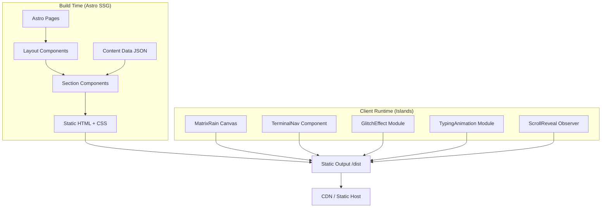

# Design Document: Personal Website Redesign

## Overview

This design describes the complete rebuild of Muhammad Ali Hasan's personal website (hxn.sh) from a legacy Bootstrap-based static site to a modern Astro-based project with a terminal/hacker-inspired aesthetic. The new site uses Astro's Islands Architecture to deliver a zero-JS-by-default static site with isolated interactive components (matrix rain canvas, terminal navigator, glitch effects) that hydrate only when needed.

The architecture prioritizes:
- **Performance**: Static HTML output with selective hydration; Lighthouse 90+ target
- **Immersive UX**: Terminal-inspired navigation, CRT overlays, matrix rain, glitch effects
- **Maintainability**: Component-based Astro architecture with typed content data
- **Accessibility**: Keyboard navigation, reduced-motion support, WCAG contrast compliance

## Architecture

### High-Level Architecture



### Technology Choices

| Concern | Choice | Rationale |
|---------|--------|-----------|
| Framework | Astro 4.x | Zero-JS default, Islands Architecture, static output |
| Styling | Scoped Astro styles + global CSS | No external CSS framework needed; full control over terminal aesthetic |
| Animations | Vanilla JS + Canvas API | No library dependency; full control over matrix rain and glitch effects |
| Typography | JetBrains Mono (self-hosted) | Open-source monospace font with excellent legibility; subset for performance |
| Content | JSON data files in `src/data/` | Simple, typed, no CMS overhead for a single-page portfolio |
| Deployment | Static output (`astro build`) | Compatible with Vercel/Netlify/Cloudflare Pages |

### Design Decisions

1. **No UI framework (React/Vue/Svelte)**: The interactive components are small enough to implement as vanilla JS with Astro's `<script>` tags and `client:load`/`client:visible` directives. This avoids shipping a framework runtime.

2. **Canvas for matrix rain, CSS for CRT/scanlines**: The matrix rain effect requires per-frame character rendering best suited to Canvas. CRT scanlines and flicker are pure CSS overlays (repeating-linear-gradient + keyframe animations) with negligible performance cost.

3. **Single-page with sections**: The site is a single `index.astro` page with anchor-linked sections rather than multi-page routing. This matches the terminal navigation metaphor where commands "scroll to" sections.

4. **Self-hosted font subsets**: JetBrains Mono is subset to Latin characters and served as WOFF2 from `/public/fonts/` to avoid external CDN requests and ensure fast font loading.

## Components and Interfaces

### Project Structure

```
/
├── public/
│   └── fonts/
│       └── JetBrainsMono-Regular.woff2
│       └── JetBrainsMono-Bold.woff2
├── src/
│   ├── components/
│   │   ├── HeroSection.astro
│   │   ├── ExperienceSection.astro
│   │   ├── SkillsSection.astro
│   │   ├── CertificationsSection.astro
│   │   ├── EducationSection.astro
│   │   ├── ContactSection.astro
│   │   ├── TerminalNav.astro
│   │   ├── MatrixRain.astro
│   │   ├── AsciiArt.astro
│   │   └── CrtOverlay.astro
│   ├── layouts/
│   │   └── BaseLayout.astro
│   ├── scripts/
│   │   ├── matrix-rain.ts
│   │   ├── terminal-nav.ts
│   │   ├── glitch-effect.ts
│   │   ├── typing-animation.ts
│   │   └── scroll-reveal.ts
│   ├── styles/
│   │   ├── global.css
│   │   ├── theme.css
│   │   └── crt.css
│   ├── data/
│   │   └── profile.json
│   └── pages/
│       └── index.astro
├── astro.config.mjs
├── tsconfig.json
└── package.json
```

### Component Descriptions

#### BaseLayout.astro
The root layout wrapping all pages. Provides:
- HTML document structure with meta tags, Open Graph, and favicon
- Global CSS imports (theme, fonts, CRT overlay)
- `<slot />` for page content
- Reduced-motion detection script

#### TerminalNav.astro
The interactive terminal navigation island. Renders a fixed-position terminal window with:
- A command prompt input (`visitor@hxn.sh:~$`)
- Command history display
- Clickable nav links as fallback

Hydrated with `client:load` since it's always visible and interactive.

#### MatrixRain.astro
A full-viewport `<canvas>` element positioned behind content. Renders falling green characters using requestAnimationFrame. Hydrated with `client:load` for immediate visual impact. Respects `prefers-reduced-motion` by disabling animation.

#### CrtOverlay.astro
A pure-CSS component (no JS hydration needed). Applies:
- Scanline effect via repeating-linear-gradient pseudo-element
- Subtle screen flicker via CSS keyframe animation
- Optional vignette darkening at edges

#### Section Components (Hero, Experience, Skills, Certifications, Education, Contact)
Static Astro components that import data from `profile.json` and render content. No client-side JS needed — they are pure HTML/CSS at build time.

### Script Modules

#### terminal-nav.ts
```typescript
interface TerminalCommand {
  name: string;
  aliases: string[];
  description: string;
  action: () => void;
}

interface TerminalState {
  history: string[];
  commandRegistry: Map<string, TerminalCommand>;
}
```

Core logic:
- Parses user input from the terminal input field
- Matches against registered commands (case-insensitive, supports aliases)
- Executes navigation (smooth scroll to section) or displays help
- Maintains command history for display

#### matrix-rain.ts
```typescript
interface RainConfig {
  fontSize: number;
  speed: number;
  density: number;
  characters: string;
  color: string;
  fadeOpacity: number;
}
```

Core logic:
- Initializes canvas to viewport dimensions
- Creates column array based on canvas width / fontSize
- Each frame: draws semi-transparent black rect (fade trail), then draws random character at each column's current Y position
- Resets column to top randomly when it reaches bottom
- Pauses/stops when `prefers-reduced-motion` is active or tab is hidden

#### glitch-effect.ts
```typescript
interface GlitchConfig {
  intensity: number;
  duration: number;
  sliceCount: number;
}
```

Core logic:
- On hover/focus of target elements, applies CSS clip-path slicing
- Randomly offsets RGB channels using CSS transforms
- Uses CSS custom properties for dynamic values driven by JS
- Duration-limited to avoid seizure risk

#### typing-animation.ts
Core logic:
- Accepts a target element and text content
- Types characters one-by-one with configurable delay
- Shows blinking cursor during and after typing
- Triggers on page load for hero, on scroll-reveal for other sections

#### scroll-reveal.ts
Core logic:
- Uses IntersectionObserver to detect when sections enter viewport
- Triggers terminal-style reveal: characters appear sequentially (like `cat` output)
- Adds CSS class to mark sections as "revealed" (no re-animation on re-scroll)

## Data Models

### profile.json Structure

```typescript
interface Profile {
  name: string;
  role: string;
  company: string;
  tagline: string;
  social: SocialLink[];
  experience: Experience[];
  skills: SkillCategory[];
  certifications: CertificationGroup[];
  education: Education[];
}

interface SocialLink {
  platform: string;
  url: string;
  label: string;
}

interface Experience {
  title: string;
  company: string;
  startDate: string;       // "YYYY-MM" format
  endDate: string | null;  // null = present
  description: string;
}

interface SkillCategory {
  category: string;
  items: string[];
}

interface CertificationGroup {
  provider: string;
  certifications: Certification[];
}

interface Certification {
  name: string;
  code?: string;
}

interface Education {
  degree: string;
  institution: string;
  gpa?: string;
  graduationYear?: number;
}
```

### Terminal Command Registry

```typescript
interface CommandDefinition {
  name: string;
  aliases: string[];
  description: string;
  targetSection: string;  // CSS selector for scroll target
}

// Default commands
const COMMANDS: CommandDefinition[] = [
  { name: "about", aliases: ["whoami", "hero"], description: "Who is Muhammad Ali Hasan", targetSection: "#hero" },
  { name: "experience", aliases: ["exp", "work"], description: "Professional experience", targetSection: "#experience" },
  { name: "skills", aliases: ["tech", "stack"], description: "Technical skills", targetSection: "#skills" },
  { name: "certs", aliases: ["certifications", "cert"], description: "Professional certifications", targetSection: "#certifications" },
  { name: "education", aliases: ["edu", "school"], description: "Education background", targetSection: "#education" },
  { name: "contact", aliases: ["social", "links"], description: "Contact and social links", targetSection: "#contact" },
  { name: "help", aliases: ["?", "commands"], description: "List available commands", targetSection: "" },
  { name: "clear", aliases: ["cls"], description: "Clear terminal history", targetSection: "" },
];
```


## Correctness Properties

*A property is a characteristic or behavior that should hold true across all valid executions of a system — essentially, a formal statement about what the system should do. Properties serve as the bridge between human-readable specifications and machine-verifiable correctness guarantees.*

### Property 1: Dated entries are rendered in reverse chronological order

*For any* list of dated entries (experience or education) with valid date fields, the rendering function SHALL output them ordered from most recent to oldest (descending by start date or graduation year).

**Validates: Requirements 5.6, 8.4**

### Property 2: Skills are grouped by category

*For any* set of skill categories containing items, the rendering function SHALL output all items within their parent category grouping — no item should appear outside its designated category.

**Validates: Requirements 6.7**

### Property 3: Valid commands resolve to correct target section

*For any* registered command name or alias in the terminal command registry, executing that command SHALL resolve to the correct target section identifier as defined in the command definition.

**Validates: Requirements 9.2**

### Property 4: Unrecognized commands produce help response

*For any* input string that does not match any registered command name or alias (case-insensitive), the terminal navigation system SHALL return a help/error response listing available commands.

**Validates: Requirements 9.3**

### Property 5: Non-decorative images have alt text

*For any* `` element in the rendered HTML output that does not have `role="presentation"` or `aria-hidden="true"`, the element SHALL have a non-empty `alt` attribute.

**Validates: Requirements 12.3**

### Property 6: Text color contrast meets WCAG AA

*For any* text element rendered on the page, the contrast ratio between its computed foreground color and its computed background color SHALL be at least 4.5:1.

**Validates: Requirements 12.4**

## Error Handling

### Terminal Navigation Errors

| Scenario | Handling |
|----------|----------|
| Empty input (user presses Enter with no text) | No-op; re-display prompt |
| Unrecognized command | Display help message with available commands |
| Target section not found in DOM | Log warning to console; display "Section not found" in terminal output |
| JavaScript disabled | Terminal input hidden; clickable nav links remain functional as static HTML |

### Animation Errors

| Scenario | Handling |
|----------|----------|
| Canvas context unavailable | Matrix rain component renders nothing; page remains functional |
| `prefers-reduced-motion: reduce` active | All animations disabled; content displays statically |
| Tab/window hidden (Page Visibility API) | Pause requestAnimationFrame loops to save resources |
| Resize event during animation | Debounce resize handler (150ms); reinitialize canvas dimensions |

### Build Errors

| Scenario | Handling |
|----------|----------|
| Missing profile.json data | Build fails with descriptive error (Astro import will throw) |
| Invalid date format in experience data | TypeScript compilation error at build time |
| Missing font files | Fallback to system monospace (`ui-monospace, 'Courier New', monospace`) |

### Content Graceful Degradation

The site follows progressive enhancement:
1. **No JS**: All content is visible as static HTML. Terminal nav hidden, clickable links work. No animations.
2. **Reduced motion**: Content visible, terminal nav works, no visual effects.
3. **Full experience**: All animations, terminal nav, matrix rain, glitch effects active.

## Testing Strategy

### Unit Tests (Vitest)

Unit tests cover specific examples and edge cases:

- **Terminal command parser**: Test specific commands ("experience", "exp", "HELP") resolve correctly
- **Profile data validation**: Test that profile.json matches the TypeScript interface
- **Date sorting utility**: Test specific date orderings with known inputs
- **Typing animation timing**: Test character-by-character output for specific strings

### Property-Based Tests (fast-check + Vitest)

Property-based tests verify universal correctness properties using the `fast-check` library with Vitest as the test runner.

**Configuration:**
- Minimum 100 iterations per property test
- Each test tagged with: `Feature: personal-website-redesign, Property {number}: {property_text}`

**Properties to implement:**
1. Reverse chronological ordering of dated entries
2. Skill category grouping integrity
3. Command resolution correctness (valid commands)
4. Unrecognized command help response (invalid commands)
5. Alt text presence on non-decorative images (build output validation)
6. Color contrast ratio compliance

### Integration Tests

- **Build output validation**: Run `astro build` and verify output structure
- **Lighthouse CI**: Automated performance score check (>= 90)
- **HTML validation**: W3C validator on build output
- **Responsive layout**: Visual regression at 320px, 768px, 1024px, 1440px, 2560px
- **Keyboard navigation**: Automated tab-through test verifying no focus traps

### Manual Testing

- Cross-browser verification (Chrome, Firefox, Safari, Edge)
- Screen reader testing (VoiceOver, NVDA)
- Mobile device testing (iOS Safari, Android Chrome)
- Animation performance profiling (Chrome DevTools)
- `prefers-reduced-motion` behavior verification
